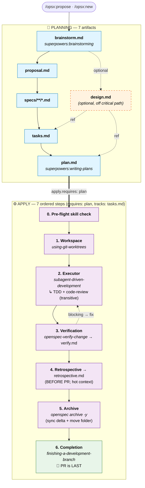

# superpowers-bridge Schema

[English](./README.md) · [繁體中文](./README.zh-TW.md)

> Bridges OpenSpec's artifact governance (the **what**) with [obra/superpowers](https://github.com/obra/superpowers) execution skills (the **how**) into a single workflow. Adds an evidence-first `retrospective` artifact filling a gap Superpowers does not natively cover.
>
> The integration lives entirely at the prompt layer — no Superpowers source modified, no OpenSpec CLI changes. Schema version: v1.

---

## Install

### Method 1: Claude Code one-shot prompt (recommended)

Copy and paste this into Claude Code in your project root:

```
Install the superpowers-bridge schema for OpenSpec into this project:

1. Verify the project has an `openspec/` directory (run `openspec init` if missing).
2. Clone https://github.com/JiangWay/openspec-schemas to a temp dir.
3. Copy the `superpowers-bridge/` subdirectory to `openspec/schemas/superpowers-bridge/`.
4. Run `openspec schema validate superpowers-bridge` to verify.
5. Run `openspec schemas` and confirm `superpowers-bridge` is listed.
6. If a CLAUDE.md exists at the project root, ask me whether to insert the workflow-routing fragment from `openspec/schemas/superpowers-bridge/templates/adopters/CLAUDE.md.fragment.<locale>.md` (auto-detect locale from existing CLAUDE.md content; default zh-TW for Traditional Chinese, no suffix for English). If I say yes, append the fragment as a new section. If no CLAUDE.md exists, skip.
7. Clean up the temp directory.
8. Verify Superpowers plugin is installed by running `claude plugin list`.
   If not listed, run `claude plugin install superpowers@claude-plugins-official`.
9. Show me the final state.
```

### Method 2: Manual bash (CI / non-Claude environments)

```bash
git clone https://github.com/JiangWay/openspec-schemas /tmp/oss
cp -R /tmp/oss/superpowers-bridge ~/your-project/openspec/schemas/superpowers-bridge

# Optional: insert workflow-routing fragment into CLAUDE.md
# cat /tmp/oss/superpowers-bridge/templates/adopters/CLAUDE.md.fragment.md       # English
# cat /tmp/oss/superpowers-bridge/templates/adopters/CLAUDE.md.fragment.zh-TW.md # zh-TW

rm -rf /tmp/oss
cd ~/your-project
openspec schema validate superpowers-bridge
claude plugin install superpowers@claude-plugins-official  # if not already
```

---

## Upgrading an existing install

If your project already has `openspec/schemas/superpowers-bridge/` and you want to pull the latest version, use one of the upgrade methods below. The upgrade overwrites the entire `superpowers-bridge/` directory and offers a CLAUDE.md fragment update — see "What the upgrade overwrites" below.

### Upgrade Method 1: Claude Code one-shot prompt (recommended)

In your project root, paste this into Claude Code:

```
Upgrade the superpowers-bridge schema in this project:

1. Verify `openspec/schemas/superpowers-bridge/` already exists (upgrade, not fresh install). If missing, abort and tell me to use the install instructions instead.
2. Clone https://github.com/JiangWay/openspec-schemas to a temp dir.
3. Show me the diff between the local `openspec/schemas/superpowers-bridge/` and the cloned `superpowers-bridge/` (use `diff -ruN`). Wait for my ack before overwriting.
4. After my ack, overwrite the local schema dir with the cloned one.
5. Run `openspec schema validate superpowers-bridge` to verify.
6. Check whether this project has `CLAUDE.md` at the repo root.
   - If yes: scan it for an existing workflow-routing section referencing superpowers-bridge.
     - If found: show me the diff between that section and `superpowers-bridge/templates/adopters/CLAUDE.md.fragment.<locale>.md`. Wait for my ack before replacing.
     - If not found: ask whether to insert the new fragment from `templates/adopters/CLAUDE.md.fragment.<locale>.md`.
   - If no CLAUDE.md exists: skip.
7. Clean up the temp directory.
8. Show me the final state.
```

> `<locale>` defaults to `zh-TW` if your CLAUDE.md is in Traditional Chinese, or no suffix (English). Claude detects from existing CLAUDE.md content.

### Upgrade Method 2: Manual bash

```bash
# 1. Get the latest bundle
git clone https://github.com/JiangWay/openspec-schemas /tmp/oss-upgrade

# 2. Review the diff first (don't overwrite blindly)
diff -ruN ~/your-project/openspec/schemas/superpowers-bridge /tmp/oss-upgrade/superpowers-bridge

# 3. After reviewing, overwrite
rm -rf ~/your-project/openspec/schemas/superpowers-bridge
cp -R /tmp/oss-upgrade/superpowers-bridge ~/your-project/openspec/schemas/superpowers-bridge

# 4. Validate
cd ~/your-project && openspec schema validate superpowers-bridge

# 5. CLAUDE.md fragment (manual)
# View /tmp/oss-upgrade/superpowers-bridge/templates/adopters/CLAUDE.md.fragment.md
# Compare against your CLAUDE.md and insert/update the corresponding section as needed

# 6. Clean up
rm -rf /tmp/oss-upgrade
```

### What the upgrade overwrites

| Path | Action | Manual step? |
|---|---|---|
| `openspec/schemas/superpowers-bridge/` | Auto-overwritten — entire directory replaced from upstream (`rm -rf` + `cp -R` in Method 2; equivalent in Method 1) | None |
| `CLAUDE.md` (project root) | The schema dir ships `templates/adopters/CLAUDE.md.fragment.<locale>.md`; the upgrade procedure diffs your existing CLAUDE.md against this fragment and waits for your ack before inserting / replacing | Yes — review diff, choose insert / replace / keep |

> The bridge directory is monolithic — you take the whole new version or stay on the old one. There is no per-file opt-in. CLAUDE.md is the only project-root file the upgrade ever touches, and never without your ack.

> In-flight changes (any phase: brainstorm / design / specs / ...) remain valid because the schema graph (`requires:` edges, PRECHECKs, artifact dependencies) hasn't changed in v1.x. Existing `verify.md` / `retrospective.md` from before the upgrade are still readable; if you re-run `/opsx:verify` or `/opsx:continue → retrospective` on them, the new template structure applies on overwrite.

> If a future upgrade modifies the schema graph structurally (artifact add/remove, `requires:` edge changes, PRECHECK changes), the README will gain a version field and a migration guide. v1 → v1.x prose-only changes are safe and do not need migration.

---

## What problem does this solve?

OpenSpec governs **what to do** (artifact lifecycle: proposal / specs / tasks / verify, etc.). Superpowers governs **how to do it** (execution discipline: brainstorming, writing-plans, TDD, code review). Each is solid on its own; interleaving them in real development surfaces three structural problems:

1. **Output duplication** — brainstorming writes design output to `docs/superpowers/specs/`; OpenSpec re-authors `proposal.md` / `design.md` in the change directory, with overlapping content.
2. **Task fragmentation** — OpenSpec's `tasks.md` (coarse checkboxes) and Superpowers' `plan.md` (TDD micro-steps) describe the same work in different formats, locations, and progress trackers.
3. **Manual orchestration** — the user has to decide on every step which skill to invoke; the two systems do not connect on their own.

### Why a custom schema rather than modifying existing skills?

Two alternatives were considered and rejected:

- **Adding custom fields to `config.yaml`** (e.g., `skill_bindings`): the OpenSpec CLI does not recognize them — no validation, no discoverability, requires editing multiple SKILL.md files.
- **Editing the opsx skill files directly**: invasive (affects every change) and fragile (overwritten on SKILL.md upgrade).

A custom schema uses OpenSpec's **native project-level schema mechanism**: the CLI validates structure, `openspec schemas` lists it automatically, each change picks its schema independently (`--schema spec-driven` or `--schema superpowers-bridge`), and no existing SKILL.md or command file is modified.

---

## Entry & exit gates

This schema's instructions only fire when invoked through `/opsx:*` commands. If you trigger Superpowers skills via narrative — for example, by saying "let's discuss the architecture" — the default behavior bypasses the schema. Brainstorming will still write to `docs/superpowers/specs/`, defeating the integration's redirection.

This section covers three things:

1. When you don't need to enter the schema at all (just open a PR)
2. When verbal brainstorming should be promoted to an opsx change
3. Front-door anti-patterns to avoid once the schema is installed

### When NOT to enter the schema (direct PR)

Not every change needs a `change` directory. The following scenarios should skip opsx entirely:

| Scenario | Need a change? | What to do |
|---|---|---|
| New feature / new capability | ✅ Yes | `/opsx:new <name> --schema superpowers-bridge` |
| Breaking change | ✅ Yes | Same |
| Architecture change | ✅ Yes | Same |
| Bug fix (restoring intended behavior, no contract change) | ❌ No | Direct PR |
| Test backfill / coverage | ❌ No | Direct PR |
| Build tooling tweak (linter rule, coverage threshold) | ❌ No | Direct PR |
| Non-breaking dependency upgrade | ❌ No | Direct PR |
| Documentation update / typo fix | ❌ No | Direct PR |
| Config value tweak (no structural change) | ❌ No | Direct PR |

> Principle: **process ceremony should scale with risk**. External contracts, cross-system integration, DB schema changes, compliance boundaries → run a change. Typos, bug fixes, timeout adjustments → direct PR. For ambiguous cases, use the 5-condition checklist below.

### When verbal brainstorming should be promoted to a change

If `superpowers:brainstorming` was triggered via narrative ("let's brainstorm the architecture") in a project that uses this schema, the brainstorming output **MUST NOT** land in `docs/superpowers/specs/` — that bypasses the schema's output redirection and creates orphan artifacts.

The correct flow: keep brainstorming verbally until all 5 conditions below hold, then promote to `/opsx:propose` or `/opsx:new` so the agreed design lands in `openspec/changes/<name>/brainstorm.md`.

1. **Scope locked** — one sentence describes what's in / out, and the scope doesn't keep growing each turn
2. **Major design forks resolved** — alternatives have been weighed and one chosen; remaining unknowns are **explicit TBDs** (with owner and impact-scope statement), not "haven't thought about it yet"
3. **Cross-system dependencies mapped** — for each dependency: ready / mockable / genuinely unknown — pick one
4. **Acceptance criteria stateable** — concrete pass conditions (e.g., `./mvnw clean verify` passes + N specific deliverables)
5. **Conversation converging** — the last 1-2 turns are confirmations, not new "what about..." forks

If any condition is missing, keep brainstorming. When all five hold:
- The model **should proactively suggest** "this looks ready for `/opsx:propose` — want to open a change?"
- The user **may also explicitly say** "open this as an opsx change"
- Either way, **promotion requires a deliberate human ack** — never automatic

### Front-door anti-patterns

| Anti-pattern | Why it's wrong |
|---|---|
| Letting brainstorming write to `docs/superpowers/specs/` after the schema is installed | Bypasses redirection at [schema.yaml](./schema.yaml) lines 35-39; produces orphan artifacts |
| Letting writing-plans write to `docs/superpowers/plans/` | Same reason (schema.yaml lines 169-171) |
| Promoting to opsx with unresolved blocking TBDs | Those TBDs will block apply phase too — promotion just defers the same problem |
| Opening a change for bug fix / typo / config tweak | Process ceremony exceeds actual risk; slows delivery without value |

---

## Workflow & integration

### Artifact DAG

```text
brainstorm ──→ proposal ──→ specs ──→ tasks ──→ plan ──→ [apply] ──→ verify ──→ retrospective
                  │                     ↑
                  └──→ design ──────────┘
                       (optional)
```

Differences from `spec-driven`:

| | spec-driven | superpowers-bridge |
|---|---|---|
| Entry | proposal (manual) | **brainstorm** (invokes brainstorming skill) |
| Plan layer | tasks (coarse) | tasks + **plan** (TDD micro-steps) |
| apply requires | tasks | **plan** |
| apply method | standard task-by-task | **worktree + subagent-driven-development** (with TDD + code-review transitive) |
| Post-apply | (none) | **verify** + **retrospective** artifacts |
| New artifacts | — | brainstorm, plan, verify, retrospective |

### Lifecycle (apply orchestration + timing notes)

The Artifact DAG above shows **file-existence** dependencies. The runtime lifecycle below adds the apply phase's ordered steps and the **timing offsets** between graph edges and actual production order.



ASCII fallback (CLI-readable):

```text
PLANNING ━━━━━━━━━━━━━━━━━━━━━━━━━━━━━━━━━━━━━━━━━━━━━━━━━━━━━━
  brainstorm.md ──┬─→ proposal.md ──→ specs/**/*.md ──→ tasks.md ──→ plan.md
                  └─→ design.md (optional, reference for tasks/plan)
                                                                       │
                          apply.requires: [plan], apply.tracks: tasks  ▼
APPLY ━━━━━━━━━━━━━━━━━━━━━━━━━━━━━━━━━━━━━━━━━━━━━━━━━━━━━━━━
  0. Pre-flight skill check
  1. superpowers:using-git-worktrees
  2. superpowers:subagent-driven-development (+ TDD + code-review transitive)
  3. openspec-verify-change → verify.md ◄┐
                              │           │ blocking → fix
                              ▼           │
  4. retrospective.md (BEFORE PR; hot context)
  5. openspec archive -y (sync delta + move folder)
  6. superpowers:finishing-a-development-branch (🏁 PR is LAST)
```

> **Timing notes** (full rationale in "Six design touches" #6):
> - `verify.md` declares `requires: plan` in the graph but is actually produced inside apply step 3.
> - `retrospective.md` declares `requires: verify` and per Step 4 is produced **before** the PR opens — so the PR diff includes the complete archived cycle (all artifacts done, spec synced, change folder under `archive/`).
> - The `requires:` edges are file-existence dependencies for OpenSpec's graph engine; runtime ordering lives in instruction prose.

### Seven Superpowers touchpoints

| # | Superpowers skill | Where it's invoked | Trigger |
|---|---|---|---|
| 1 | `superpowers:brainstorming` | `brainstorm` artifact instruction | Direct (with PRECHECK) |
| 2 | `superpowers:writing-plans` | `plan` artifact instruction | Direct (with PRECHECK) |
| 3 | `superpowers:using-git-worktrees` | apply step 1 | Direct |
| 4 | `superpowers:subagent-driven-development` | apply step 2 | Direct |
| 5 | `superpowers:test-driven-development` | (activated inside #4) | **Transitive** |
| 6 | `superpowers:requesting-code-review` | (activated inside #4) | **Transitive** |
| 7 | `superpowers:finishing-a-development-branch` | apply step 4 | Direct |

Plus one OpenSpec built-in: `openspec-verify-change` (apply step 3, produces `verify.md`).

> **No `executing-plans` fallback.** This schema is opinionated: it requires a subagent-capable platform (Claude Code, Codex, etc.). The alternative executor `superpowers:executing-plans` does not transitively activate TDD or code-review (verified against its [SKILL.md](https://github.com/obra/superpowers/blob/main/skills/executing-plans/SKILL.md)) — falling back would silently degrade Superpowers' core value. If your platform lacks subagent support, use the built-in `spec-driven` schema instead.

### Output redirection

Superpowers skills have default output paths (e.g., brainstorming writes to `docs/superpowers/specs/`). This schema's artifact instructions **override** that behavior by injecting context that redirects output into the change directory:

- brainstorming → `openspec/changes/<name>/brainstorm.md` (+ optional `design.md`)
- writing-plans → `openspec/changes/<name>/plan.md`

Implemented purely via context injection at invocation time, not by modifying skill source.

---

## Usage

### Quick flow (recommended)
```bash
/opsx:ff my-feature    # one-shot: scaffold + brainstorm + proposal + design + specs + tasks + plan
/opsx:apply            # worktree + subagent-driven-development (with TDD + code-review)
/opsx:verify           # produces verify.md (7 checks)
/opsx:continue         # → retrospective (produces retrospective.md, §0 + 6 sections)
/opsx:archive          # archive
```

### Step-by-step flow
```bash
/opsx:new my-feature --schema superpowers-bridge
/opsx:continue         # → brainstorm (interactive dialogue)
/opsx:continue         # → proposal
/opsx:continue         # → design (optional, only when explaining technical decisions)
/opsx:continue         # → specs
/opsx:continue         # → tasks
/opsx:continue         # → plan
/opsx:apply            # → implementation + worktree + subagent-driven-development
/opsx:verify           # → verify.md (post-apply, runs the 7 checks)
/opsx:continue         # → retrospective.md (post-verify, evidence-first §0 + 6 sections)
/opsx:archive
```

### Switching back to spec-driven
```bash
# Use a different schema for one change
/opsx:new my-simple-fix --schema spec-driven

# Or change project default in openspec/config.yaml: schema: spec-driven
```

---

## Apply phase walkthrough

`/opsx:apply` triggers the steps inside [schema.yaml](./schema.yaml)'s `apply.instruction`:

#### 0. Pre-flight — verify required Superpowers skills

Confirms these skills are installed before proceeding:

- `superpowers:using-git-worktrees`
- `superpowers:subagent-driven-development` (transitive: `test-driven-development`, `requesting-code-review`)
- `superpowers:finishing-a-development-branch`

Missing skill → STOP with explicit error. No silent fallback, no manual mode within this schema. The user should either install Superpowers or switch to the built-in `spec-driven` schema for that change.

> The v0 version of this schema once placed an "auto-commit change artifacts to current branch" step here. It was removed after the [PR #970 review](https://github.com/Fission-AI/OpenSpec/pull/970): handling untracked change directories is the worktree skill's responsibility, not the schema's.

#### 1. Workspace — `superpowers:using-git-worktrees`

Creates `.worktrees/<change-name>/`, switches to a new branch, runs setup, confirms a clean test baseline.

#### 2. Executor — `superpowers:subagent-driven-development`

Main agent reads `plan.md`, dispatches a fresh subagent per micro-task. Each subagent transitively activates:

- **TDD** (`superpowers:test-driven-development`): write failing test → watch it fail → minimal code → pass; production code without prior test gets deleted
- **Per-task code review** (`superpowers:requesting-code-review`): spec-compliance review + code-quality review; critical issues block forward motion

Coarse `tasks.md` checkboxes tick as tasks complete. After all tasks, a final code review covers the whole implementation.

This schema does NOT support `superpowers:executing-plans` as a fallback. See the "Six design touches" section below for rationale.

#### 3. Verification — `openspec-verify-change`

Produces `verify.md` from 7 checks: structural validation (`openspec validate --all --json`), task completion, delta-spec sync state, design/specs coherence (non-blocking warning), implementation signal (committed code), front-door routing leak detector (non-blocking warning), and deferred-dogfood vs automated-test equivalence. The last check blocks only when `plan.md` has `[~]` deferrals but the equivalence section is empty (gap analysis skipped); otherwise it is informational.

Failures route back to the corresponding artifact for fix; verify can be re-run.

> **Steps 4–6 are the canonical post-verify sequence: retro → archive → PR. Reordering produces incomplete PRs (retrospective + archive land as trailing post-merge commits, losing hot context).**

#### 4. Retrospective — `retrospective` artifact (recommended; per Entry & exit gates skip rules, trivial fixes may skip)

Evidence-first reflection: §0 Evidence (quantitative front-matter — commit count, diff size, tasks-done ratio, dependencies, validate state, etc.) plus 6 analysis sections (Wins / Misses / Plan deviations / Skill compliance / Surprises / Promote candidates). Each claim cites a commit / file / measurable fact, typically referencing §0 instead of inlining evidence per bullet. The procedure is embedded in the artifact's instruction — no external skill required (Decision 3 in the design spec defers Claude Code plugin packaging to v1.x).

Written **before** opening the PR so retro lands in the same PR diff.

#### 5. Archive — `openspec archive -y` (or `/opsx:archive`)

Syncs delta specs into `openspec/specs/<capability>/spec.md` and moves the change folder to `openspec/changes/archive/YYYY-MM-DD-<name>/`. Run **before** the PR opens so the diff reflects the complete archived cycle (all artifacts done, spec synced, folder under archive/).

#### 6. Completion — `superpowers:finishing-a-development-branch`

Confirms tests are green, presents merge / PR / keep-branch / discard options, cleans up the worktree. **PR is the last step** — if retro or archive haven't been done, finish them first.

---

## CLI cheat sheet

| Scenario | Command |
|---|---|
| First clone of a project | `bash scripts/install-git-hooks.sh` |
| New change (interactive) | `/opsx:new <name> --schema superpowers-bridge` then `/opsx:continue` |
| New change (one-shot) | `/opsx:ff <name>` |
| Resume an interrupted change | `/opsx:continue <name>` |
| Enter implementation | `/opsx:apply <name>` |
| Manual verify | `/opsx:verify <name>` |
| Archive | `/opsx:archive <name>` |
| Use built-in (skip brainstorm) | `/opsx:new <name> --schema spec-driven` |
| List all schemas in the project | `openspec schemas` |
| Inspect a change's progress | `openspec status --change <name> --json` |
| List active changes | `openspec list` |
| Validate the entire project | `openspec validate --all --json` |

---

## Six design touches worth remembering

### 1. Skill-name PRECHECK (Layer 1 capability detection)

Each artifact / apply step that invokes a Superpowers skill runs a PRECHECK at the start of its instruction, confirming the skill exists in the LLM's available skills list. **Missing skill = STOP, no silent fallback.** This is the concrete answer to layer 1 of [PR #970 review](https://github.com/Fission-AI/OpenSpec/pull/970)'s concern #1 — fail loud, fail early.

### 2. Schema-level vs prompt-level integration

Integration lives entirely in `instruction:` fields (pure prompts). If Superpowers upgrades a skill's behavior, the schema doesn't change. We only touch `schema.yaml` if a skill is renamed or removed.

### 3. Transitive dependencies made explicit

TDD and code-review are normally hidden inside `subagent-driven-development`'s SKILL.md. Our schema's apply step 2a instruction lists these two transitive activations explicitly, so a reader can see "what actually happens during apply" at a glance.

### 4. Opinionated: subagent platforms only, no manual fallback

This schema requires a subagent-capable platform (Claude Code, Codex, etc.). The alternative executor `superpowers:executing-plans` does NOT transitively activate TDD or code-review (verified against its [SKILL.md](https://github.com/obra/superpowers/blob/main/skills/executing-plans/SKILL.md) — its body has no mention of either, and its Integration section omits both `test-driven-development` and `requesting-code-review`). Falling back to it would silently lose what Superpowers brings to this integration. We prefer to fail loud at Step 0 and direct users to the built-in `spec-driven` schema instead.

### 5. Evidence-based PRECHECK for verify and retrospective (Layer 2 capability detection)

Each timing-sensitive artifact runs concrete shell evidence checks at the start of its instruction:

- **verify**: `git log <base>..HEAD | wc -l > 0` AND `grep -c '^- \[x\]' tasks.md > 0`
- **retrospective**: `test -f verify.md` AND `! grep -q '^- \[x\] ❌ FAIL' verify.md`

The LLM does not need to interpret timing prose — it runs commands and reads results. This is layer 2 of concern #1 / mitigation for concern #2.

### 6. verify and retrospective are time-mismatched artifacts (known limitation)

`verify.requires: [plan]` and `retrospective.requires: [verify]` are file-existence dependencies in the schema graph, but each instruction explicitly states "MUST run AFTER apply phase / verify pass". This is intentional misalignment — OpenSpec's engine only checks predecessor file existence. Engine-native fix awaits a `post_apply` phase concept upstream (analogous to spec-kit's `after_implement` hook); evidence-based PRECHECK above is the v1 mitigation.

---

## Snapshot template for adopting projects

Each project that adopts `superpowers-bridge` should keep a snapshot like this in its own docs:

```markdown
## Current project state (snapshot: YYYY-MM-DD)

- **OpenSpec CLI**: v<version>
- **Schema**: `superpowers-bridge` v<n>
- **Specs (bounded-context granularity)**: <n> domains exist, <n> reserved for lazy backfill
- **Automation**: <which openspec commands run in pre-commit / CI>
- **Superpowers plugin**: `superpowers@<version>`, this integration uses N skills
```

> Snapshot will go stale; for live state, run `openspec list` + `openspec schemas`.

---

## Design decisions worth knowing

### Why `brainstorm` is an artifact, not a hook

Brainstorming is multi-turn interactive dialogue requiring user participation. Modeling it as the first artifact (rather than a schema-level hook) gives two advantages:

1. **Skippable** — if the user already knows what to build, they can author `brainstorm.md` directly without invoking the skill.
2. **Trackable** — `openspec status` reports brainstorm completion, and downstream artifacts have explicit dependencies on it.

### Why `plan` is separate from `tasks`

`tasks.md` is a coarse checkbox ("Add PdfServiceTest"); `plan.md` is micro-steps ("scaffold test → write downloadPdf test → run → commit"). They serve different purposes:

- `tasks.md` → tracks overall progress (apply phase's `tracks` field parses these checkboxes)
- `plan.md` → guides subagents step by step (the executor's input)

Apply requires `plan` (not `tasks`) because the executor needs micro-steps; `tracks: tasks.md` ensures progress is still surfaced via the coarse checkboxes.

### Fallback strategy

If a Superpowers skill is unavailable:

- **`brainstorm` / `plan` artifacts** — the user may explicitly opt in to writing the artifact manually (PRECHECK STOPs and informs the user; manual override requires deliberate user action, not silent degradation)
- **`apply` phase** — no manual fallback within this schema. PRECHECK STOPs at Step 0 if any required skill is missing. The recommended path is to switch to the built-in `spec-driven` schema for that change. Rationale: see Design touch #4 above — `executing-plans` does not transitively activate TDD or code-review, and a degraded apply phase would defeat the schema's purpose.

---

## Related

- [schema.yaml](./schema.yaml) — machine-readable schema definition
- [templates/](./templates/) — markdown templates per artifact
- [README.zh-TW.md](./README.zh-TW.md) — 繁體中文版
- [obra/superpowers](https://github.com/obra/superpowers) — Superpowers skill source
- [Fission-AI/OpenSpec](https://github.com/Fission-AI/OpenSpec) — OpenSpec
- [OpenSpec PR #970](https://github.com/Fission-AI/OpenSpec/pull/970) — original review thread that drove this design
