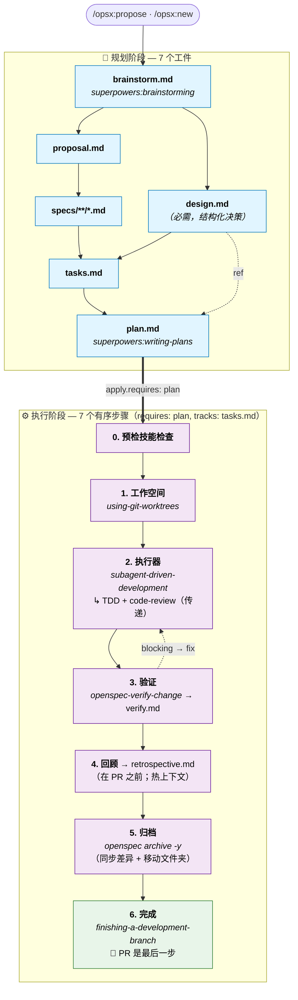

# superpowers-bridge Schema

[English](./README.md) · [繁體中文](./README.zh-TW.md) · [简体中文](./README.zh-CN.md)

[](https://github.com/yitshu/openspec-schemas/actions/workflows/validate-schemas.yml)
[](https://github.com/yitshu/openspec-schemas/issues?q=is%3Aopen+label%3Aupstream-version-check)
[](#compatibility)
[](#compatibility)

> 将 [OpenSpec](https://github.com/Fission-AI/OpenSpec) 的工件治理（**做什么**）与 [obra/superpowers](https://github.com/obra/superpowers) 的执行技能（**怎么做**）桥接为单一工作流。新增了一个以证据为先的 `retrospective` 工件，填补了 Superpowers 本身未覆盖的空白。
>
> 整个集成完全存在于提示词层面——未修改任何 Superpowers 源码，未改动 OpenSpec CLI。Schema 版本：v1。

---

## 安装

### 方法 1：Claude Code 一次性提示（推荐）

在项目根目录中将以下内容复制粘贴到 Claude Code：

```
Install the superpowers-bridge schema for OpenSpec into this project:

1. Verify the project has an `openspec/` directory (run `openspec init` if missing).
2. Clone https://github.com/yitshu/openspec-schemas to a temp dir.
3. Copy the `superpowers-bridge/` subdirectory to `openspec/schemas/superpowers-bridge/`.
4. Run `openspec schema validate superpowers-bridge` to verify.
5. Run `openspec schemas` and confirm `superpowers-bridge` is listed.
6. If a CLAUDE.md exists at the project root, ask me whether to insert the workflow-routing fragment from `openspec/schemas/superpowers-bridge/templates/adopters/CLAUDE.md.fragment.<locale>.md` (auto-detect locale from existing CLAUDE.md content; default zh-CN for Simplified Chinese, zh-TW for Traditional Chinese, no suffix for English). If I say yes, append the fragment as a new section. If no CLAUDE.md exists, skip.
7. Clean up the temp directory.
8. Verify Superpowers plugin is installed by running `claude plugin list`.
   If not listed, run `claude plugin install superpowers@claude-plugins-official`.
9. Show me the final state.
```

### 方法 2：手动 bash（CI / 非 Claude 环境）

```bash
git clone https://github.com/yitshu/openspec-schemas /tmp/oss
cp -R /tmp/oss/superpowers-bridge ~/your-project/openspec/schemas/superpowers-bridge

# 可选：将工作流路由片段插入 CLAUDE.md
# cat /tmp/oss/superpowers-bridge/templates/adopters/CLAUDE.md.fragment.md       # English
# cat /tmp/oss/superpowers-bridge/templates/adopters/CLAUDE.md.fragment.zh-CN.md # zh-CN
# cat /tmp/oss/superpowers-bridge/templates/adopters/CLAUDE.md.fragment.zh-TW.md # zh-TW

rm -rf /tmp/oss
cd ~/your-project
openspec schema validate superpowers-bridge
claude plugin install superpowers@claude-plugins-official  # 如果尚未安装
```

---

## 升级现有安装

如果您的项目已有 `openspec/schemas/superpowers-bridge/` 且需要拉取最新版本，请使用下方的升级方法之一。升级会覆盖整个 `superpowers-bridge/` 目录，并提供 CLAUDE.md 片段更新——详见下方"升级覆盖范围"。

### 升级方法 1：Claude Code 一次性提示（推荐）

在项目根目录中，将以下内容粘贴到 Claude Code：

```
Upgrade the superpowers-bridge schema in this project:

1. Verify `openspec/schemas/superpowers-bridge/` already exists (upgrade, not fresh install). If missing, abort and tell me to use the install instructions instead.
2. Clone https://github.com/yitshu/openspec-schemas to a temp dir.
3. Show me the diff between the local `openspec/schemas/superpowers-bridge/` and the cloned `superpowers-bridge/` (use `diff -ruN`). Wait for my ack before overwriting.
4. After my ack, overwrite the local schema dir with the cloned one.
5. Run `openspec schema validate superpowers-bridge` to verify.
6. Check whether this project has `CLAUDE.md` at the repo root.
   - If yes: scan it for an existing workflow-routing section referencing superpowers-bridge.
     - If found: show me the diff between that section and `superpowers-bridge/templates/adopters/CLAUDE.md.fragment.<locale>.md`. Wait for my ack before replacing.
     - If not found: ask whether to insert the new fragment from `templates/adopters/CLAUDE.md.fragment.<locale>.md`.
   - If no CLAUDE.md exists: skip.
7. Clean up the temp directory.
8. Show me the final state.
```

> `<locale>` 在 CLAUDE.md 为简体中文时默认为 `zh-CN`，繁体中文时默认为 `zh-TW`，英文时无后缀。Claude 会从现有 CLAUDE.md 内容自动检测。

### 升级方法 2：手动 bash

```bash
# 1. 获取最新包
git clone https://github.com/yitshu/openspec-schemas /tmp/oss-upgrade

# 2. 先查看 diff（不要盲目覆盖）
diff -ruN ~/your-project/openspec/schemas/superpowers-bridge /tmp/oss-upgrade/superpowers-bridge

# 3. 审查后覆盖
rm -rf ~/your-project/openspec/schemas/superpowers-bridge
cp -R /tmp/oss-upgrade/superpowers-bridge ~/your-project/openspec/schemas/superpowers-bridge

# 4. 验证
cd ~/your-project && openspec schema validate superpowers-bridge

# 5. CLAUDE.md 片段（手动）
# 查看 /tmp/oss-upgrade/superpowers-bridge/templates/adopters/CLAUDE.md.fragment.md
# 与您的 CLAUDE.md 进行对比，按需插入/更新相应章节

# 6. 清理
rm -rf /tmp/oss-upgrade
```

### 升级覆盖范围

| 路径 | 操作 | 需要手动步骤？ |
|---|---|---|
| `openspec/schemas/superpowers-bridge/` | 自动覆盖——从上游替换整个目录（方法 2 中使用 `rm -rf` + `cp -R`；方法 1 中等效操作） | 无 |
| `CLAUDE.md`（项目根目录） | Schema 目录附带 `templates/adopters/CLAUDE.md.fragment.<locale>.md`；升级流程会将您现有的 CLAUDE.md 与此片段进行 diff，并在插入/替换前等待您的确认 | 是——审查 diff，选择插入/替换/保留 |

> 桥接目录是整体性的——要么采用全新版本，要么保留旧版本，没有逐文件选择。CLAUDE.md 是升级过程中唯一会触及的项目根目录文件，且绝不会在未获确认的情况下修改。

> 进行中的变更（任何阶段：头脑风暴 / 设计 / 规范 / ...）仍然有效，因为 schema 图（`requires:` 边、PRECHECK、工件依赖）在 v1.x 中未发生变更。升级前已有的 `verify.md` / `retrospective.md` 仍可读取；如果您对它们重新运行 `/opsx:verify` 或 `/opsx:continue → retrospective`，新模板结构将在覆盖时生效。

> 如果未来的升级在结构上修改了 schema 图（增减工件、`requires:` 边变更、PRECHECK 变更），README 将新增版本字段和迁移指南。v1 → v1.x 的纯文案变更无需迁移。

---

## 解决什么问题？

OpenSpec 管控**做什么**（工件生命周期：提案 / 规范 / 任务 / 验证等）。Superpowers 管控**怎么做**（执行规范：头脑风暴、撰写计划、TDD、代码审查）。两者各自完善，但在实际开发中交织使用时会暴露三个结构性问题：

1. **输出重复** —— 头脑风暴将设计输出写入 `docs/superpowers/specs/`；OpenSpec 在变更目录中重新编写 `proposal.md` / `design.md`，内容存在重叠。
2. **任务碎片化** —— OpenSpec 的 `tasks.md`（粗粒度复选框）和 Superpowers 的 `plan.md`（TDD 微步骤）以不同格式、不同位置、不同进度跟踪器描述同一工作。
3. **手动编排** —— 用户在每一步都需要决定调用哪个技能；两个系统之间无法自动衔接。

### 为什么使用自定义 schema 而非修改现有技能？

考虑并排除了两种替代方案：

- **向 `config.yaml` 添加自定义字段**（如 `skill_bindings`）：OpenSpec CLI 无法识别——没有验证、没有可发现性，且需要编辑多个 SKILL.md 文件。
- **直接编辑 opsx 技能文件**：侵入性强（影响每个变更）且脆弱（SKILL.md 升级时会被覆盖）。

自定义 schema 使用 OpenSpec 的**原生项目级 schema 机制**：CLI 验证结构、`openspec schemas` 自动列出、每个变更独立选择其 schema（`--schema spec-driven` 或 `--schema superpowers-bridge`），且不修改任何现有的 SKILL.md 或命令文件。

---

## 进入与退出门控

此 schema 的指令仅在通过 `/opsx:*` 命令调用时触发。如果您通过叙述方式触发 Superpowers 技能——例如说"我们来讨论一下架构"——默认行为会绕过 schema。头脑风暴仍会写入 `docs/superpowers/specs/`，导致集成的重定向失效。

本节涵盖三个内容：

1. 何时不需要进入 schema（直接提交 PR）
2. 何时应将口头头脑风暴升级为 opsx 变更
3. 安装 schema 后应避免的入口反模式

### 何时不进入 schema（直接 PR）

并非每个变更都需要 `change` 目录。以下场景应完全跳过 opsx：

| 场景 | 需要变更？ | 操作方式 |
|---|---|---|
| 新功能 / 新能力 | ✅ 是 | `/opsx:new <name> --schema superpowers-bridge` |
| 破坏性变更 | ✅ 是 | 同上 |
| 架构变更 | ✅ 是 | 同上 |
| Bug 修复（恢复预期行为，无合约变更） | ❌ 否 | 直接 PR |
| 测试补充 / 覆盖率 | ❌ 否 | 直接 PR |
| 构建工具调整（linter 规则、覆盖率阈值） | ❌ 否 | 直接 PR |
| 非破坏性依赖升级 | ❌ 否 | 直接 PR |
| 文档更新 / 错别字修复 | ❌ 否 | 直接 PR |
| 配置值调整（无结构变更） | ❌ 否 | 直接 PR |

> 原则：**流程仪式感应与风险成正比**。外部合约、跨系统集成、数据库 Schema 变更、合规边界 → 运行变更。错别字、Bug 修复、超时调整 → 直接 PR。对于模糊情况，请使用下方的五条件检查清单。

### 何时应将口头头脑风暴升级为变更

如果在使用此 schema 的项目中通过叙述方式（"我们来头脑风暴一下架构"）触发了 `superpowers:brainstorming`，头脑风暴的输出**不得**写入 `docs/superpowers/specs/`——那会绕过 schema 的输出重定向并产生孤立工件。

正确的流程：继续口头头脑风暴，直到以下 5 个条件全部满足，然后升级为 `/opsx:propose` 或 `/opsx:new`，使达成共识的设计落入 `openspec/changes/<name>/brainstorm.md`。

1. **范围锁定** —— 一句话描述包含/不包含什么，且范围不会每轮增长
2. **主要设计分支已收敛** —— 替代方案已评估并选定其一；剩余的未知项是**明确的 TBD**（附带负责人和影响范围声明），而非"还没想过"
3. **跨系统依赖已梳理** —— 每个依赖：就绪 / 可 mock / 真的未知——三选一
4. **验收条件可陈述** —— 具体的通过条件（如 `./mvnw clean verify` 通过 + N 个具体交付物）
5. **对话正在收敛** —— 最近 1-2 轮是确认性内容，而非新的"那如果..."分支

如果任一条件未满足，继续头脑风暴。当五个条件全部满足时：
- 模型**应主动建议**"看起来可以 `/opsx:propose` 了——要开启一个变更吗？"
- 用户**也可以明确说**"将此作为 opsx 变更开启"
- 无论哪种方式，**升级都需要用户明确确认**——绝非自动执行

### 入口反模式

| 反模式 | 问题所在 |
|---|---|
| 在 schema 安装后仍让头脑风暴写入 `docs/superpowers/specs/` | 绕过 [schema.yaml](./schema.yaml) 第 35-39 行的重定向；产生孤立工件 |
| 让 writing-plans 写入 `docs/superpowers/plans/` | 同上（schema.yaml 第 169-171 行） |
| 在存在未解决的阻塞性 TBD 时升级到 opsx | 这些 TBD 同样会阻塞 apply 阶段——升级只是推迟了同一问题 |
| 为 Bug 修复 / 错别字 / 配置调整开启变更 | 流程仪式感超过实际风险；降低交付速度且无额外价值 |

---

## 工作流与集成

### 工件 DAG

```text
brainstorm ──┬──→ proposal ──→ specs ──┐
             │                         ├──→ tasks ──→ plan ──→ [apply] ──→ verify ──→ retrospective
             └──→ design ──────────────┘
```

与 `spec-driven` 的差异：

| | spec-driven | superpowers-bridge |
|---|---|---|
| 入口 | proposal（手动） | **brainstorm**（调用头脑风暴技能） |
| 计划层 | tasks（粗粒度） | tasks + **plan**（TDD 微步骤） |
| apply 依赖 | tasks | **plan** |
| apply 方式 | 标准逐任务执行 | **worktree + subagent-driven-development**（含 TDD + code-review 传递） |
| apply 后续 | （无） | **verify** + **retrospective** 工件 |
| 新增工件 | — | brainstorm、plan、verify、retrospective |

### 生命周期（apply 编排 + 时序说明）

上方的工件 DAG 展示的是**文件存在性**依赖。下方的运行时生命周期补充了 apply 阶段的有序步骤以及图边与实际产出顺序之间的**时序偏移**。



ASCII 回退（CLI 可读）：

```text
PLANNING ━━━━━━━━━━━━━━━━━━━━━━━━━━━━━━━━━━━━━━━━━━━━━━━━━━━━━━
  brainstorm.md ──┬─→ proposal.md ──→ specs/**/*.md ──┐
                  │                                   ├─→ tasks.md ──→ plan.md
                  └─→ design.md (required) ───────────┘
                                                                       │
                          apply.requires: [plan], apply.tracks: tasks  ▼
APPLY ━━━━━━━━━━━━━━━━━━━━━━━━━━━━━━━━━━━━━━━━━━━━━━━━━━━━━━━━
  0. Pre-flight skill check
  1. superpowers:using-git-worktrees
  2. superpowers:subagent-driven-development (+ TDD + code-review transitive)
  3. openspec-verify-change → verify.md ◄┐
                              │           │ blocking → fix
                              ▼           │
  4. retrospective.md (BEFORE PR; hot context)
  5. openspec archive -y (sync delta + move folder)
  6. superpowers:finishing-a-development-branch (🏁 PR is LAST)
```

> **时序说明**（完整原理见"六个设计要点"第 6 条）：
> - `verify.md` 在图中声明 `requires: plan`，但实际上在 apply 步骤 3 内产出。
> - `retrospective.md` 声明 `requires: verify`，根据步骤 4 在 PR 开启**之前**产出——因此 PR diff 包含完整的归档周期（所有工件完成、规范已同步、变更文件夹在 `archive/` 下）。
> - `requires:` 边是 OpenSpec 图引擎的文件存在性依赖；运行时顺序由指令文案定义。

### 七个 Superpowers 接触点

| # | Superpowers 技能 | 调用位置 | 触发方式 |
|---|---|---|---|
| 1 | `superpowers:brainstorming` | `brainstorm` 工件指令 | 直接（含 PRECHECK） |
| 2 | `superpowers:writing-plans` | `plan` 工件指令 | 直接（含 PRECHECK） |
| 3 | `superpowers:using-git-worktrees` | apply 步骤 1 | 直接 |
| 4 | `superpowers:subagent-driven-development` | apply 步骤 2 | 直接 |
| 5 | `superpowers:test-driven-development` | （在 #4 内部激活） | **传递** |
| 6 | `superpowers:requesting-code-review` | （在 #4 内部激活） | **传递** |
| 7 | `superpowers:finishing-a-development-branch` | apply 步骤 4 | 直接 |

另加一个 OpenSpec 内置：`openspec-verify-change`（apply 步骤 3，产出 `verify.md`）。

> **无 `executing-plans` 回退。** 此 schema 具有强主张性：它要求具备子代理能力的平台（Claude Code、Codex 等）。替代执行器 `superpowers:executing-plans` 不会传递激活 TDD 或 code-review（已对照其 [SKILL.md](https://github.com/obra/superpowers/blob/main/skills/executing-plans/SKILL.md) 验证）——回退会悄然削弱 Superpowers 的核心价值。如果您的平台不支持子代理，请改用内置的 `spec-driven` schema。

### 输出重定向

Superpowers 技能有默认输出路径（如头脑风暴写入 `docs/superpowers/specs/`）。此 schema 的工件指令通过注入上下文**覆盖**该行为，将输出重定向到变更目录：

- brainstorming → `openspec/changes/<name>/brainstorm.md`
- writing-plans → `openspec/changes/<name>/plan.md`

完全通过调用时的上下文注入实现，不修改技能源码。

---

## 使用方式

### 快速流程（推荐）
```bash
/opsx:ff my-feature    # 一次性：脚手架 + 头脑风暴 + 提案 + 设计 + 规范 + 任务 + 计划
/opsx:apply            # worktree + subagent-driven-development（含 TDD + code-review）
/opsx:verify           # 产出 verify.md（7 项检查）
/opsx:continue         # → retrospective（产出 retrospective.md，§0 + 6 个章节）
/opsx:archive          # 归档
```

### 逐步流程
```bash
/opsx:new my-feature --schema superpowers-bridge
/opsx:continue         # → brainstorm（交互式对话）
/opsx:continue         # → proposal
/opsx:continue         # → design（将头脑风暴重组为结构化决策）
/opsx:continue         # → specs
/opsx:continue         # → tasks
/opsx:continue         # → plan
/opsx:apply            # → 实现 + worktree + subagent-driven-development
/opsx:verify           # → verify.md（apply 后，运行 7 项检查）
/opsx:continue         # → retrospective.md（验证后，以证据为先的 §0 + 6 个章节）
/opsx:archive
```

### 切换回 spec-driven
```bash
# 为单个变更使用不同的 schema
/opsx:new my-simple-fix --schema spec-driven

# 或在 openspec/config.yaml 中更改项目默认值：schema: spec-driven
```

---

## Apply 阶段详解

`/opsx:apply` 触发 [schema.yaml](./schema.yaml) 中 `apply.instruction` 的步骤：

#### 0. 预检 — 验证必需的 Superpowers 技能

在继续之前确认以下技能已安装：

- `superpowers:using-git-worktrees`
- `superpowers:subagent-driven-development`（传递依赖：`test-driven-development`、`requesting-code-review`）
- `superpowers:finishing-a-development-branch`

缺少技能 → 停止并给出明确错误。在此 schema 内无静默回退，无手动模式。用户应安装 Superpowers 或为该变更切换到内置的 `spec-driven` schema。

> 此 schema 的 v0 版本曾在此处放置"将变更工件自动提交到当前分支"的步骤。该步骤在 [PR #970 审查](https://github.com/Fission-AI/OpenSpec/pull/970)后被移除：处理未跟踪的变更目录是 worktree 技能的职责，而非 schema 的。

#### 1. 工作空间 — `superpowers:using-git-worktrees`

创建 `.worktrees/<change-name>/`，切换到新分支，运行设置，确认干净的测试基线。

#### 2. 执行器 — `superpowers:subagent-driven-development`

主代理读取 `plan.md`，为每个微任务调度一个新的子代理。每个子代理传递激活：

- **TDD**（`superpowers:test-driven-development`）：编写失败测试 → 观察失败 → 最小代码 → 通过；没有事先测试的生产代码将被删除
- **逐任务代码审查**（`superpowers:requesting-code-review`）：规范符合性审查 + 代码质量审查；关键问题会阻塞后续流程

粗粒度的 `tasks.md` 复选框随任务完成而勾选。所有任务完成后，最终代码审查覆盖整个实现。

此 schema 不支持 `superpowers:executing-plans` 作为回退。详见下方"六个设计要点"部分。

#### 3. 验证 — `openspec-verify-change`

从 7 项检查产出 `verify.md`：结构验证（`openspec validate --all --json`）、任务完成度、差异规范同步状态、设计/规范一致性（非阻塞警告）、实现信号（已提交代码）、入口路由泄漏检测器（非阻塞警告）、以及延迟 dogfood 与自动化测试等价性。最后一项检查仅在 `plan.md` 存在 `[~]` 延迟项但等价性章节为空（跳过了差距分析）时阻塞；否则为信息性输出。

失败会路由回对应工件进行修复；verify 可重新运行。

> **步骤 4–6 是标准的验证后序列：回顾 → 归档 → PR。重新排序会产生不完整的 PR（回顾 + 归档作为合并后的尾随提交，丢失热上下文）。**

#### 4. 回顾 — `retrospective` 工件（推荐；根据进入与退出门控的跳过规则，微小修复可跳过）

以证据为先的反思：§0 证据（量化前置信息——提交数、diff 大小、任务完成比、依赖、验证状态等）加 6 个分析章节（收获 / 不足 / 计划偏差 / 技能合规 / 意外发现 / 推广候选）。每项声明引用提交 / 文件 / 可度量的事实，通常引用 §0 而非在每条中内联证据。流程嵌入在工件指令中——不需要外部技能（设计规范中的决策 3 将 Claude Code 插件打包推迟到 v1.x）。

在开启 PR **之前**编写，使回顾落在同一个 PR diff 中。

#### 5. 归档 — `openspec archive -y`（或 `/opsx:archive`）

将差异规范同步到 `openspec/specs/<capability>/spec.md` 并将变更文件夹移动到 `openspec/changes/archive/YYYY-MM-DD-<name>/`。在 PR 开启**之前**运行，使 diff 反映完整的归档周期（所有工件完成、规范已同步、文件夹在 archive/ 下）。

#### 6. 完成 — `superpowers:finishing-a-development-branch`

确认测试通过，呈现合并 / PR / 保留分支 / 丢弃选项，清理 worktree。**PR 是最后一步** —— 如果回顾或归档尚未完成，需先完成它们。

---

## CLI 速查表

| 场景 | 命令 |
|---|---|
| 首次克隆项目 | `bash scripts/install-git-hooks.sh` |
| 新变更（交互式） | `/opsx:new <name> --schema superpowers-bridge` 然后 `/opsx:continue` |
| 新变更（一次性） | `/opsx:ff <name>` |
| 恢复被中断的变更 | `/opsx:continue <name>` |
| 进入实现 | `/opsx:apply <name>` |
| 手动验证 | `/opsx:verify <name>` |
| 归档 | `/opsx:archive <name>` |
| 使用内置（跳过头脑风暴） | `/opsx:new <name> --schema spec-driven` |
| 列出项目中所有 schema | `openspec schemas` |
| 查看变更进度 | `openspec status --change <name> --json` |
| 列出活跃变更 | `openspec list` |
| 验证整个项目 | `openspec validate --all --json` |

---

## 六个值得铭记的设计要点

### 1. 技能名称 PRECHECK（第 1 层能力检测）

每个调用 Superpowers 技能的工件 / apply 步骤都会在其指令开头运行 PRECHECK，确认该技能存在于 LLM 的可用技能列表中。**缺少技能 = 停止，无静默回退。** 这是对 [PR #970 审查](https://github.com/Fission-AI/OpenSpec/pull/970) 问题 #1 第 1 层的具体回答——大声失败，尽早失败。

### 2. Schema 层级 vs 提示词层级集成

集成完全存在于 `instruction:` 字段中（纯提示词）。如果 Superpowers 升级了某个技能的行为，schema 无需更改。仅在技能被重命名或移除时才需要修改 `schema.yaml`。

### 3. 显式化的传递依赖

TDD 和 code-review 通常隐藏在 `subagent-driven-development` 的 SKILL.md 内。我们 schema 的 apply 步骤 2a 指令显式列出这两个传递激活，让读者一目了然地看到"apply 期间实际发生了什么"。

### 4. 强主张性：仅支持子代理平台，无手动回退

此 schema 要求具备子代理能力的平台（Claude Code、Codex 等）。替代执行器 `superpowers:executing-plans` 不会传递激活 TDD 或 code-review（已对照其 [SKILL.md](https://github.com/obra/superpowers/blob/main/skills/executing-plans/SKILL.md) 验证——其正文未提及两者，且其集成章节省略了 `test-driven-development` 和 `requesting-code-review`）。回退会悄然丢失 Superpowers 为本集成带来的核心价值。我们选择在步骤 0 大声失败，引导用户使用内置的 `spec-driven` schema。

### 5. 基于证据的 PRECHECK 用于 verify 和 retrospective（第 2 层能力检测）

每个时序敏感的工件在其指令开头运行具体的 shell 证据检查：

- **verify**：`git log <base>..HEAD | wc -l > 0` 且 `grep -c '^- \[x\]' tasks.md > 0`
- **retrospective**：`test -f verify.md` 且 `! grep -q '^- \[x\] ❌ FAIL' verify.md`

LLM 无需解释时序文案——它运行命令并读取结果。这是问题 #1 第 2 层 / 问题 #2 缓解措施。

### 6. verify 和 retrospective 是时序错位的工件（已知局限）

`verify.requires: [plan]` 和 `retrospective.requires: [verify]` 是 schema 图中的文件存在性依赖，但各指令明确声明"必须在 apply 阶段 / verify 通过后运行"。这是有意的错位——OpenSpec 引擎仅检查前驱文件是否存在。引擎原生修复等待上游的 `post_apply` 阶段概念（类似于 spec-kit 的 `after_implement` 钩子）；上述基于证据的 PRECHECK 是 v1 的缓解措施。

---

## 版本控制

此包携带**两个版本标识符**，不应混淆：

| 标识符 | 位置 | 含义 | 示例 |
|---|---|---|---|
| Schema 主版本 | `schema.yaml: version: 1` | Schema 图的契约（工件、`requires:` 边、PRECHECK 形态）。破坏性变更会提升此版本。 | `1` |
| 包发布版本 | `VERSION` 文件 + git tag | 此包的语义化版本发布，限定在某个 schema 主版本范围内。 | `1.0.0`（tag `v1.0.0`） |

包发布版本 `1.x.y` 是 schema 主版本 `v1` 的一个已发布切面。未来的 schema 主版本 `v2` 将从 `2.0.0` 重新开始包发布。锁定到 `v1.x.y` 的使用者在 v1 主版本内保证 schema 图兼容性。

> 下方的兼容性矩阵使用 `v1`（schema 主版本）作为行键，因为与 OpenSpec / Superpowers 的兼容性由 schema 契约决定，而非此包内的补丁级编辑。

## 兼容性

此 schema 编写时所依据的基线版本。这是**历史快照，而非端到端兼容性保证**——CI 无法在无头模式下运行完整的提示词层工作流，因此行为兼容性在漂移触发时依赖人工审查。

当前包发布版本：**`1.0.0`**（git tag `v1.0.0`；见 [VERSION](./VERSION)）。

| superpowers-bridge | OpenSpec CLI | Superpowers 插件 | 基线截至 |
|---|---|---|---|
| v1 | `1.3.1` | `v5.1.0` | 2026-05-11 |

### 检查方式

契约是三层的——**基线声明 + 自动漂移检测 + 人工审查**——而非自动兼容性强制。

| 层级 | 机制 | 捕获内容 | 触发时机 |
|---|---|---|---|
| 结构 | 每次 push/PR 运行 [`validate-schemas.yml`](../.github/workflows/validate-schemas.yml)；每周对照最新 OpenSpec 运行 [`version-check.yml`](../.github/workflows/version-check.yml) | Schema 图断裂（字段重命名、移除的 `requires:` 边、PRECHECK 语法变更） | CI 运行显示红灯 |
| 漂移通知 | [`version-check.yml`](../.github/workflows/version-check.yml) 每周运行，将上述基线与最新 npm / GitHub 发布对比 | 锁定版本 ≠ 最新上游版本 | 为人工审查创建/更新[带标签的漂移 issue](https://github.com/yitshu/openspec-schemas/issues?q=is%3Aopen+label%3Aupstream-version-check)（工作流保持绿灯——漂移是正常现象，非失败） |
| 端到端工作流 | **未自动化** | Superpowers 技能内部的行为变更（重命名、修改 PRECHECK 语义的文案重写、传递依赖变更）；OpenSpec 引擎的细微语义偏移 | 人工在漂移 issue 触发时阅读上游发布说明 |

"基线截至"日期在维护者手动对列出版本重新运行完整周期并确认无退化时才更新。在此之前，该日期仅代表人工认证，而非自动化测试通过。

### 已知破坏性变更

截至目前无。未来的 schema 图结构性变更（增减工件、`requires:` 边变更、PRECHECK 变更）将在此列出并附迁移说明。

对使用者的建议：锁定到不低于上述列出的版本。要查看您项目的运行时状态，请运行 `openspec list` + `openspec schemas` + `claude plugin list`。

---

## 值得了解的设计决策

### 为什么 `brainstorm` 是工件而非钩子

头脑风暴是需要用户参与的多轮交互式对话。将其建模为第一个工件（而非 schema 级钩子）有两个优势：

1. **可跳过** —— 如果用户已经知道要构建什么，可以直接编写 `brainstorm.md` 而不调用技能。
2. **可追踪** —— `openspec status` 报告头脑风暴完成状态，下游工件对其有显式依赖。

### 为什么 `plan` 与 `tasks` 分离

`tasks.md` 是粗粒度复选框（"添加 PdfServiceTest"）；`plan.md` 是微步骤（"搭建测试脚手架 → 编写 downloadPdf 测试 → 运行 → 提交"）。它们服务于不同目的：

- `tasks.md` → 跟踪整体进度（apply 阶段的 `tracks` 字段解析这些复选框）
- `plan.md` → 逐步引导子代理（执行器的输入）

Apply 依赖 `plan`（而非 `tasks`），因为执行器需要微步骤；`tracks: tasks.md` 确保进度仍通过粗粒度复选框呈现。

### 回退策略

如果 Superpowers 技能不可用：

- **`brainstorm` / `plan` 工件** —— 用户可以明确选择手动编写工件（PRECHECK 停止并通知用户；手动覆盖需要用户刻意操作，非静默降级）
- **`apply` 阶段** —— 在此 schema 内无手动回退。如果缺少任何必需技能，PRECHECK 在步骤 0 停止。推荐路径是为该变更切换到内置的 `spec-driven` schema。原理：见上方设计要点第 4 条——`executing-plans` 不传递激活 TDD 或 code-review，降级的 apply 阶段会使此 schema 失去意义。

---

## 相关链接

- [schema.yaml](./schema.yaml) — 机器可读的 schema 定义
- [templates/](./templates/) — 各工件的 markdown 模板
- [README.zh-TW.md](./README.zh-TW.md) — 繁體中文版
- [obra/superpowers](https://github.com/obra/superpowers) — Superpowers 技能源码
- [Fission-AI/OpenSpec](https://github.com/Fission-AI/OpenSpec) — OpenSpec
- [OpenSpec PR #970](https://github.com/Fission-AI/OpenSpec/pull/970) — 推动此设计的原始审查线程
